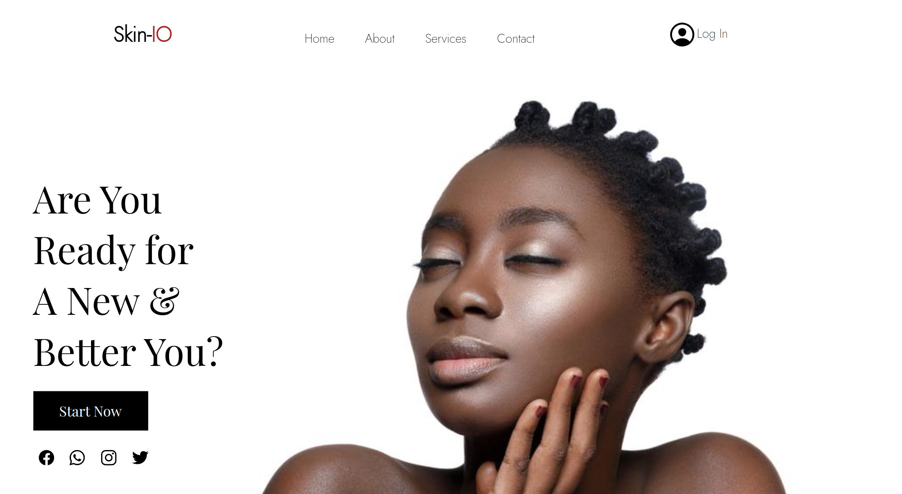

# Skin-IO

#### By Wendy Nina, Collins Nyakoe, Maureen Njung'e, Rachel Namiba, Elizabeth Onyango, Maureen Kamau

## Table of Content

+ [Description](#description)
+ [Installation Requirement](#Installation)
+ [Technology Used](#technology-used)
+ [Reference](#reference)
+ [License](#license)
+ [Authors Info](#author-Info)

## Description
This is is a simple website that allows you to do a skin test online, get to know your skin type and also recommendation on the best products for your skin.

### Requirements
-Either a computer,phone,tablet or an Ipad

-Make sure you have access to internet

-Click on the live link in the about section

[Go Back to the top](#Skin-IO)

### Installation Process
## Technology Used
HTML5- which was used to build the structure of the pages.

Bootstrap- which was used to build and style the form.

CSS3 - which was used to style the pages together with bootstrap.

Vanilla JS - which was used to add functionality to the form and calendar.

## Reference
(https://developer.mozilla.org/en-US/docs/Web/JavaScript/Reference)
(https://getbootstrap.com/docs/3.3/components/)

[Go Back to the top](#Skin-IO)

# License
Copyright (c) 2022 [click to view License](LICENSE)

## Authors Info
Linked In-[Wendy Nina]
(https://www.linkedin.com/in/wendy-nina-616559196/)

CodeWars-(https://www.codewars.com/users/the@rt_Coder)

[Go Back to the top](#Skin-IO)